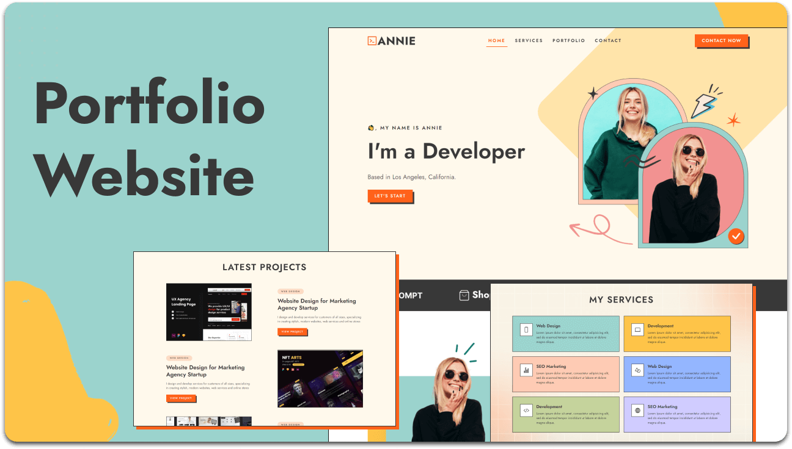

   
   

  <h2 align="center">Annie - Personal Portfolio</h2>

  <a href="https://codewithsadee.github.io/annie/"><strong>➥ Live Demo</strong></a>

 

### Demo Screeshots

## 🚀 Tecnologias

Esse projeto foi desenvolvido com as seguintes tecnologias:

- HTML
- CSS
- JavaScript

## 💻 Projeto

Annie é um portfólio pessoal totalmente responsivo,  Responsivo para todos os dispositivos, construído usando HTML, CSS e JavaScript.

## :memo: Licença

Esse projeto está sob a licença MIT. Veja o arquivo [LICENSE](LICENSE.md) para mais detalhes.

---

